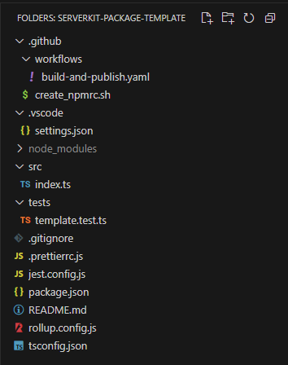

# ServerKit Private Package Template

[](https://github.com/your-repo/serverkit-template)
[](https://github.com/your-repo/serverkit-template/fork)

## 소개

이 레포지토리는 **ServerKit** 생태계에서 사용할 **프라이빗 패키지**를 제작하기 위한 템플릿입니다. 개발과 운영 환경 모두를 지원하며, 빠르고 구조화된 방식으로 프로젝트를 시작할 수 있도록 돕습니다.

## 주요 기능

- **이중 빌드 모드**

    - **개발 모드**: `src` 폴더에서 바로 작업하며 빠르고 유연한 개발 가능.
    - **운영 모드**: 최적화된 빌드를 생성하여 배포 준비.

- **Fork 준비 완료**  
  이 레포지토리를 복제하거나 포크하여 맞춤형 패키지 개발을 시작할 수 있습니다.

- **사전 구성된 환경**  
  코드 작성 및 빌드 작업을 간소화하기 위한 사전 구성 개발 환경 제공.

## 시작하기

### 사전 요구 사항

- Node.js (v20 이상 권장)
- 패키지 관리자: `npm`

### Serverkit Package 생성 방법

아래 과정은 모두 Serverkit-Project Organization에 소속된 github 계정만 가능합니다. 소속되지 않았을 경우 관리자에게 문의하세요.

## 1. github 사이트에서 이 레포지토리를 Fork합니다:

    ```bash
    https://github.com/ServerKit-Project/serverkit-package-template.git
    ```

## 2. 폴더 구조



| 폴더/파일                    | 설명                                              |
| ---------------------------- | ------------------------------------------------- |
| `.github/`                   | GitHub Actions 설정 파일 저장 폴더                |
| ├── `build-and-publish.yaml` | Workflows 설정 파일 (자세한 정보는 [3번](#3))     |
| ├── `create_npmrc.sh`        | Private 패키지 접근용 토큰 추출 스크립트          |
| `.vscode/`                   | Visual Studio Code 설정 파일 저장 폴더            |
| `src/`                       | 모듈 코드 작성 폴더 (작성 가이드는 [4번](#4))     |
| `tests/`                     | 테스트 코드 작성 폴더 (작성 가이드는 [5번](#5))   |
| `.gitignore`                 | Git에 포함되지 않을 파일 및 폴더 목록             |
| `jest.config.js`             | ts-jest 기반 테스트 설정 파일                     |
| `package.json`               | 프로젝트 정보 파일 (수정 가이드는 [6번](#6))      |
| `prettierrc.js`              | Prettier 설정 파일                                |
| `rollup.config.js`           | Rollup 번들링 설정 파일 (자세한 정보는 [7번](#7)) |
| `tsconfig.json`              | TypeScript 설정 파일                              |
| `README.md`                  | 모듈 API 문서 (모듈 정보 및 사용법 작성)          |

### 💡 package-lock.json이 포함되지 않은 이유?

`package-lock.json`은 `.gitignore`에 포함되어 있으며, 이는 아래와 같은 이유 때문입니다:

1. **Rollup의 특성**: Rollup 모듈은 개발 환경(OS 및 칩셋)에 따라 설치되는 모듈이 달라질 수 있습니다. 이로 인해 `npm ci` 명령어가 GitHub Actions에서 예상과 다른 결과를 초래합니다.
2. **OS 간 칩셋 차이**: Windows(AMD64)와 macOS(ARM64) 사용자가 함께 작업하는 환경에서 lock 파일이 오히려 충돌을 유발할 수 있습니다.

따라서 `package-lock.json`을 저장소에 포함하지 않습니다.
